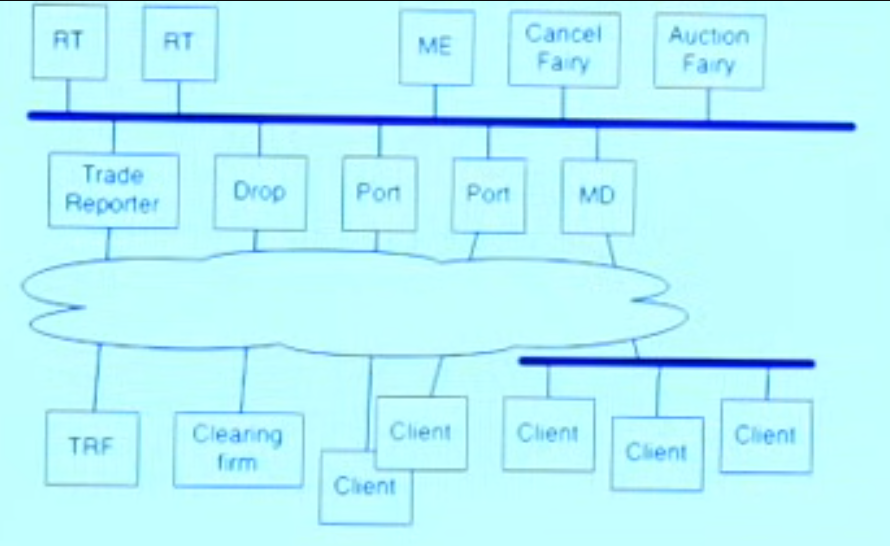
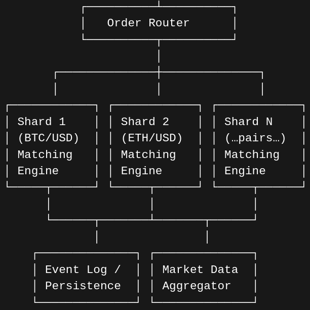

# Development

Some characteristics of the system are:
* Scale (real exchange may handle 3 million messages per second, thousands of participants, several million live orders, and 10, 000 symbols)
* Fairness (for example, use multicast for send out information and add re-transmitors servers (they record messages seen and if some message is missing they can ask each other or the ME to keep a consistent state))
* Reliability
* Durability
* Robustness to bad clients

## Major elements

1. OrderBook (NASDAQ style)
* [X] Basic OrderBook object
* [X] Handle adding orders
* [X] Handle remove orders
* [ ] Handle modify orders
* [X] Handle query book (top)

2. Support multiple symbols
_Core architecture_
* Each symbol has its own order book (std::unordered_map<std::string, std::unique_ptr<OrderBook>> symbol_books_)
* Fixed symbols, initially support 100
* Sharding of symbols (order books), initially 4 shards (25 symbols per shard)

_Concurrency model_
* Initially support 10 agents
* Real-time required --> how to give guarantees of latency?
* [ ] Single-threaded (sim) → std::mutex per book
* [ ] Multi-threaded → Lock-free queues? Sharding?
* [ ] Agent-parallel → Per-agent OrderBook copies?

_Order routing_
* [ ] addOrder(symbol, order) → Find book → Add
* [ ] removeOrder(symbol, order)
* [ ] querySymbol(symbol)
* Handle incoming orders via lock-free queues per symbol (lock needed to write to queue?)

* [ ] registerClient()

* Check if cancel/replace is its own operation and implement it if so

3. Append only logger
* [ ] Log events from ME
* [ ] Log events from port/routing
* Implement to happen async from each process (no wait) --> write lock required?
* Ensure consistency (ops are complete and in order up to current)

2. API for participants --> ports with TCP connections

3. "Cancel fairy" (for cancellations in the future)
* [ ] Regular cancel
* [ ] Cancel reject (in case a cancel cannot go through the ME) (cancel rejects are required because the protocol specifies that any change in state, in either side, has to be acknowledged)

4. Trade reporter flow (logging in this case?)

5. Market data flow

6. Basic client

## Upgrades

* Allow for trading of multiple instruments, i.e., multiple order books --> do we want to parallelize it? (expand to a full fledged "matching engine")
* Create TCP/IP ports for users to connect through and trade (ports may be the ones to find some ID of an order, in case a cancel or modify is sent, making the rest of the process cheaper for the cancel fairy and ME)
* Implement communication between internal exchange modules via UDP? is it the fastest
* Allow for Immediate-Of-Cancel and Good-Till-Cancelled orders
* Add an "auction fairy" which find out via some optimization which of the overlapping incoming orders find the price that maximizes the shares traded, sends result to matching engine
* Implement security for connection to the "outside"
* Implement robust logging to allow for state-machine-replication (of the entire system) --> can later allow for incredible reliability, as we can bring up full blocks/servers if they fail via replication of their deduced state at some point in time
* Implement a passive ME (watches ME output) to replicate the primary ME and take over if ME fails

## Development notes

* Need for speed: one-in-flight --> latency determines throughput
* Avoid copies and allocates as much possible in the critical path

**Locking (the Jane Street way)**
* Every message has a unique topic
* And a per-topic sequence number
* Contributor tries to grab next sequence number (if fails, has to change state and retry with the next number)

**Testing**
* Unit testing
* Fuzzing
* State machine replication
* Latency testing
* Chaos engineering

## Resources

* (Design a limit order book - Jordan has no life)[https://www.youtube.com/watch?v=nmYx6tQxtSs]
* (How to build an exchange - Jane Street)[https://www.youtube.com/watch?v=b1e4t2k2KJY]
